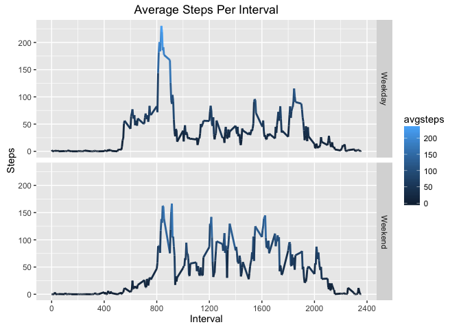

# Reproducible Research: Peer Assessment 1


## Loading and preprocessing the data

First, we unzip the compressed file, then read the csv file into data frame rawData.


```r
unzip("activity.zip")
rawData <- read.csv("activity.csv")
summary(rawData)
```

```
##      steps                date          interval     
##  Min.   :  0.00   2012-10-01:  288   Min.   :   0.0  
##  1st Qu.:  0.00   2012-10-02:  288   1st Qu.: 588.8  
##  Median :  0.00   2012-10-03:  288   Median :1177.5  
##  Mean   : 37.38   2012-10-04:  288   Mean   :1177.5  
##  3rd Qu.: 12.00   2012-10-05:  288   3rd Qu.:1766.2  
##  Max.   :806.00   2012-10-06:  288   Max.   :2355.0  
##  NA's   :2304     (Other)   :15840
```

```r
str(rawData)
```

```
## 'data.frame':	17568 obs. of  3 variables:
##  $ steps   : int  NA NA NA NA NA NA NA NA NA NA ...
##  $ date    : Factor w/ 61 levels "2012-10-01","2012-10-02",..: 1 1 1 1 1 1 1 1 1 1 ...
##  $ interval: int  0 5 10 15 20 25 30 35 40 45 ...
```

Seeing that the date is a factor, let's convert this to a data object.


```r
rawData$date <- as.Date(rawData$date, format = "%Y-%m-%d")
```

## What is mean total number of steps taken per day?

To calculate the mean total number of steps taken per day, first lets group by the date, then calculate the total


```r
library(dplyr)
library(ggplot2)
dateSum <- rawData %>% group_by(date) %>% summarize(totalsteps = sum(steps, na.rm = TRUE))

ggplot(data=dateSum, aes(dateSum$totalsteps)) + 
        geom_histogram(binwidth=2500, 
        fill="darkorchid", 
        col="black",
        alpha = .6) +
        labs(title="Steps Per Day", y="Frequency", x="")
```

<!-- -->


```r
meanSteps <- mean(dateSum$totalsteps)
medianSteps <- median(dateSum$totalsteps)
meanSteps
```

```
## [1] 9354.23
```

```r
medianSteps
```

```
## [1] 10395
```

## What is the average daily activity pattern?

In order to plot the time series of average steps taken in each daily interval, we must regroup the original data by interval, which we previously converted to a factor. 


```r
int <- rawData %>% group_by(interval) %>% summarize(avgsteps = mean(steps, na.rm = TRUE))


ggplot(data=int, aes(interval,avgsteps, group=1, color=avgsteps)) + 
        geom_line(size=1) +
        scale_x_continuous(name="Interval",
        breaks=seq(0,2400,200)) +
        labs(title="Average Steps Per Interval", y="Steps") 
```

<!-- -->

The maximum average steps are taken during this interval:

```r
maxInt <- filter(int,int$avgsteps == max(int$avgsteps) )
maxInt$interval
```

```
## [1] 835
```

## Imputing missing values

Calculating the number of missing data points in data set:

```r
missing = nrow(rawData) - sum(complete.cases(rawData))
missing
```

```
## [1] 2304
```

Replace NA values with the average number of steps for that particular interval by using ifelse():

```r
fullData <- rawData
fullData$steps <- ifelse(is.na(fullData$steps), int$avgsteps[int$interval %in% fullData$interval], fullData$steps)

summary(fullData)
```

```
##      steps             date               interval     
##  Min.   :  0.00   Min.   :2012-10-01   Min.   :   0.0  
##  1st Qu.:  0.00   1st Qu.:2012-10-16   1st Qu.: 588.8  
##  Median :  0.00   Median :2012-10-31   Median :1177.5  
##  Mean   : 37.38   Mean   :2012-10-31   Mean   :1177.5  
##  3rd Qu.: 27.00   3rd Qu.:2012-11-15   3rd Qu.:1766.2  
##  Max.   :806.00   Max.   :2012-11-30   Max.   :2355.0
```


```r
fullSum <- fullData %>% group_by(date) %>% summarize(totalsteps = sum(steps, na.rm = TRUE))

ggplot(data=fullSum, aes(fullSum$totalsteps)) + 
        geom_histogram(binwidth=2500, 
        fill="turquoise3", 
        col="black",
        alpha = .6) +
        labs(title="Steps Per Day", y="Frequency", x="")
```

<!-- -->

So, look what happens when NAs are replaced by the average interval steps!

```r
meanFull <- mean(fullSum$totalsteps)
medianFull <- median(fullSum$totalsteps)
meanFull
```

```
## [1] 10766.19
```

```r
medianFull
```

```
## [1] 10766.19
```
## Are there differences in activity patterns between weekdays and weekends?

Let's add a factor variable called daytype, and give each date a level of weekday or weekend.


```r
fullData$daytype <- as.factor(ifelse(weekdays( fullData$date) %in% c("Saturday","Sunday"), "Weekend", "Weekday")) 
head(fullData)
```

```
##       steps       date interval daytype
## 1 1.7169811 2012-10-01        0 Weekday
## 2 0.3396226 2012-10-01        5 Weekday
## 3 0.1320755 2012-10-01       10 Weekday
## 4 0.1509434 2012-10-01       15 Weekday
## 5 0.0754717 2012-10-01       20 Weekday
## 6 2.0943396 2012-10-01       25 Weekday
```
Now we'll plot the interval average step data separating weekdays from weekends

```r
intPanel <- fullData %>% group_by(interval,daytype) %>% summarize(avgsteps = mean(steps, na.rm = TRUE))

ggplot(data=intPanel, aes(interval,avgsteps, group=1, color=avgsteps)) + 
        geom_line(size=1) +
        scale_x_continuous(name="Interval",
        breaks=seq(0,2400,400)) +
        labs(title="Average Steps Per Interval", y="Steps") +
        facet_grid( daytype ~ .)
```

<!-- -->
